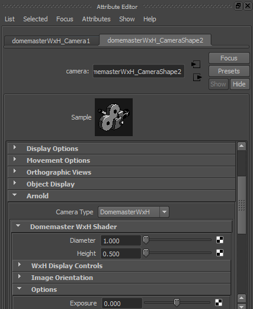
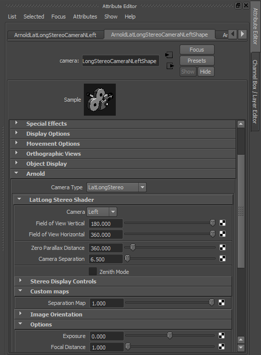
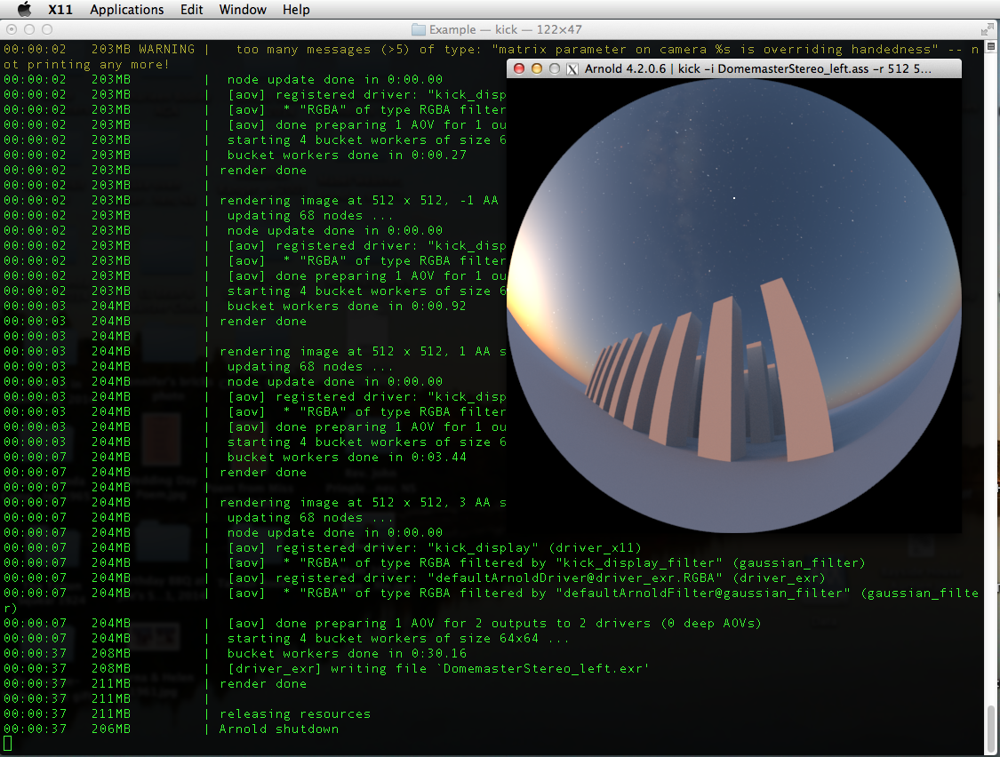

# Arnold Domemaster3D Guide #
-------------------------
2014-12-20  

## Overview ##

The Domemaster Stereo Shader is a set of fulldome stereo and latlong stereo production lens shaders for 3DS Max, Maya, Softimage, Houdini, Maxwell Studio, Mental Ray Standalone, and Arnold Standalone. The lens shaders are available for Mental Ray and Arnold, and comes integrated in Maxwell Render version 3.1+.

This guide covers the Arnold version of the Domemaster Stereo Shader.

**Tip:** After you use the Maya shelf tools to add a fulldome or latlong stereo camera rig to your scene, you need to adjust the left camera in the stereo rig to change both of the "linked" lens shader attributes for the **LatLongStereo** or **DomemasterStereo** rigs.

## Known Issues ##

The current version of the Arnold Domemaster3D shaders (as of 2014-11-23) are a development build. At this point in time there is no easy way to create screen space texture maps using Arnold's MtoA and SItoA render nodes. This means a solution has to be developed inside the Domemaster3D shaders that will remap an existing texture map into screen space coordinates.

The LatLong_Stereo shader generally works fine. The only thing to note is that there is no way to feather out the stereo effect in the zenith and nadir zones using the separation map attribute.

At this point, the DomemasterStereo shader will render a stereo fulldome image but you will notice something that looks like a small "swirly region" in the zenith part of the fulldome frame. This is due to a lack of a screen space turn map texture. 

## Shader Screenshots ##

Here are a few screenshots of the Maya Shelf tools and the Arnold based **DomemasterStereo**, **DomemasterWxH**, and **LatLongStereo** shader GUIs for Maya.

### Maya Shelf ###

### DomemasterStereo Shader ###

### DomemasterWxH Shader ###

### LatLongStereo Shader ###

## Maya Shader Installation ##

### Windows 64-bit ###

**Step 1.**
Download the [Visual Studio 2012 (VC++ 11.0) Redistributable Package](http://www.microsoft.com/en-us/download/details.aspx?id=30679).

**Step 2.**
Copy the .dll and .mtd files to the Arnold shaders directory:
`C:\solidangle\mtoadeploy\<Version>\shaders\`

Maya Shader Files:

    DomemasterStereo.dll  
    DomemasterStereo.mtd  
    DomemasterWxH.dll  
    DomemasterWxH.mtd  
    LatLongStereo.dll  
    LatLongStereo.mtd  

**Step 3.**
Copy the Maya AE template files to the Arnold AE folder:  

`C:\solidangle\mtoadeploy\<Version>\scripts\mtoa\ui\ae`

Note: The Maya AE Template path can be found using the following environment variable:  

`%MTOA_TEMPLATES_PATH%` or `%MTOA_PATH%\scripts\mtoa\ui\ae\`

**Step 4.**
Copy the Maya scripts from `Arnold-DomemasterStereo-src\install\maya\scripts` to your user account's Maya scripts folder.

**Step 5.**
Copy the Maya shelf file from `Arnold-DomemasterStereo-src\install\maya\shelves` to your user account's Maya shelves folder.

**Step 6.**
Copy the Maya icons from the `Arnold-DomemasterStereo-src\install\maya\icons` folder to your user account's Maya icons folder.

**Step 7.**
Edit your Windows Environment variables using the System Control Panel to include Arnold's env vars and path:  

    PATH="C:\solidangle\mtoadeploy\2014\bin\"  
    ARNOLD_PLUGIN_PATH="C:\solidangle\mtoadeploy\2014\shaders"  
    MAYA_RENDER_DESC_PATH="C:\solidangle\mtoadeploy\2014\"  

### Mac 64-bit ###

**Step 1.**
Copy the .dylib and .mtd files to the Arnold shaders directory:
`~/solidangle/mtoa/<Version>/shaders/`

Maya Shader Files:

    DomemasterStereo.dylib  
    DomemasterStereo.mtd  
    DomemasterWxH.dylib  
    DomemasterWxH.mtd  
    LatLongStereo.dylib  
    LatLongStereo.mtd  

**Step 2.**
Copy the Maya AE template files to the Arnold AE folder:  

`~/solidangle/mtoa/<Version>/scripts/mtoa/ui/ae/`

Note: The Maya AE Template path can be found using the following environment variable:
`$(MTOA_TEMPLATES_PATH)` or `$(MTOA_PATH)/scripts/mtoa/ui/ae/`

**Step 3.**
Copy the Maya scripts from `Arnold-DomemasterStereo-src\install\maya\scripts` to your user account's Maya scripts folder.

**Step 4.**
Copy the Maya shelf file from `Arnold-DomemasterStereo-src\install\maya\shelves` to your user account's Maya shelves folder.

**Step 5.**
Copy the Maya icons from the `Arnold-DomemasterStereo-src\install\maya\icons` folder to your user account's Maya icons folder.

**Step 6.**
Edit your `.bash_profile` to include Arnold's env vars and path:

    # Arnold Settings  
    export PATH="$PATH:$HOME/solidangle/mtoa/2014/bin/"  
    export ARNOLD_PLUGIN_PATH="$HOME/solidangle/mtoa/2014/shaders"  
    export MAYA_RENDER_DESC_PATH="$HOME/solidangle/mtoa/2014/"  

### Linux 64-bit ###

**Step 1.**
Copy the .so and .mtd files to the Arnold shaders directory:

`/opt/solidangle/mtoa/<Version>/shaders/`

Maya Shader Files:

    DomemasterStereo.so  
    DomemasterStereo.mtd  
    DomemasterWxH.so  
    DomemasterWxH.mtd  
    LatLongStereo.so  
    LatLongStereo.mtd  

**Step 2.**
Copy the Maya AE template files to the Arnold AE folder:  

`/opt/solidangle/mtoa/<Version>/scripts/mtoa/ui/ae/`

Note: The Maya AE Template path can be found using the following environment variable:
`$(MTOA_TEMPLATES_PATH)` or `$(MTOA_PATH)/scripts/mtoa/ui/ae/`

**Step 3.**
Copy the Maya scripts from `Arnold-DomemasterStereo-src\install\maya\scripts` to your user account's Maya scripts folder.

**Step 4.**
Copy the Maya shelf file from `Arnold-DomemasterStereo-src\install\maya\shelves` to your user account's Maya shelves folder.

**Step 5.**
Copy the Maya icons from the `Arnold-DomemasterStereo-src\install\maya\icons` folder to your user account's Maya icons folder.

**Step 6.**
Edit your .bash_profile to include Arnold's env vars and path:

    # Arnold Settings  
    export PATH="$PATH:/opt/solidangle/mtoa/2014/bin/"  
    export ARNOLD_PLUGIN_PATH="/opt/solidangle/mtoa/2014/shaders"  
    export MAYA_RENDER_DESC_PATH="/opt/solidangle/mtoa/2014/"  

## Verify the Shader Loaded in Arnold ##

### Listing the Nodes ###

You can list all of the active Arnold Shader nodes using:
#### Windows Node List ####

`C:\solidangle\mtoadeploy\<Version>\bin\kick.exe -nodes t`

#### Mac Node List ####

`~/solidangle/mtoa/<Version>/bin/kick -nodes t`

#### Linux Node List ####

`/opt/solidangle/mtoa/<Version>/bin/kick -nodes t`

### DomemasterStereo Node Parameters ###

If you run Arnold's Kick utility with the info flag you can see the DomemasterStereo shader's node parameters:

      WARNING |  node "DomemasterStereo" is already installed
      node:         DomemasterStereo
      type:         camera
      output:       (null)
      parameters:   27
      filename:     C:\solidangle\mtoadeploy\2014\shaders\DomemasterStereo.dll
      version:      4.2.0.6

      Type          Name                              Default
      ------------  --------------------------------  --------------------------------
      INT           camera                            0
      FLOAT         fov_angle                         180
      FLOAT         zero_parallax_sphere              360
      FLOAT         separation                        6.5
      FLOAT         forward_tilt                      0
      BOOL          tilt_compensation                 false
      BOOL          vertical_mode                     false
      FLOAT         separation_map                    1
      FLOAT         head_turn_map                     1
      FLOAT         head_tilt_map                     0.5
      INT           flip_ray_x                        false
      INT           flip_ray_y                        false
      POINT[]       position                          0, 0, 0
      POINT[]       look_at                           0, 0, -1
      VECTOR[]      up                                0, 1, 0
      MATRIX[]      matrix                            
      FLOAT         near_clip                         0.0001
      FLOAT         far_clip                          1e+30
      FLOAT         shutter_start                     0
      FLOAT         shutter_end                       0
      ENUM          shutter_type                      box
      POINT2[]      shutter_curve                     (empty)
      ENUM          rolling_shutter                   off
      FLOAT         rolling_shutter_duration          0
      NODE          filtermap                         (null)
      ENUM          handedness                        right
      FLOAT[]       time_samples                      (2 elements)
      POINT2        screen_window_min                 -1, -1
      POINT2        screen_window_max                 1, 1
      FLOAT         exposure                          0
      STRING        name   

Assuming Arnold's kick tool is in your system PATH variable, you can check if the shader is installed correctly and read the default parameters using the following parameters:

#### Windows Parameters ####

`kick.exe -info DomemasterStereo`  

`kick.exe -info DomemasterWxH`  

`kick.exe -info LatLongStereo`  

or 

you can check if the shader is installed and define a custom library search path at the same time:

`kick -l C:\solidangle\mtoadeploy\<Version>\shaders\DomemasterStereo.dll -info DomemasterStereo`

`kick -l C:\solidangle\mtoadeploy\<Version>\shaders\DomemasterWxH.dll -info DomemasterWxH`

`kick -l C:\solidangle\mtoadeploy\<Version>\shaders\LatLongStereo.dll -info LatLongStereo`

#### Mac Parameters ####

`kick -info DomemasterStereo`  

`kick -info DomemasterWxH`  

`kick -info LatLongStereo`  

or 

you can check if the shader is installed and define a custom library search path at the same time:

`kick -l ~/solidangle/mtoa/<Version>/shaders/DomemasterStereo.dylib -info DomemasterStereo`

`kick -l ~/solidangle/mtoa/<Version>/shaders/DomemasterWxH.dylib -info DomemasterWxH`

`kick -l ~/solidangle/mtoa/<Version>/shaders/LatLongStereo.dylib -info LatLongStereo`

#### Linux Parameters ####

`kick -info DomemasterStereo`  

`kick -info DomemasterWxH`  

`kick -info LatLongStereo`  

or 

you can check if the shader is installed and define a custom library search path at the same time:

`kick -l /opt/solidangle/mtoa/<Version>/shaders/DomemasterStereo.so -info DomemasterStereo`  

`kick -l /opt/solidangle/mtoa/<Version>/shaders/DomemasterWxH.so -info DomemasterWxH`  

`kick -l /opt/solidangle/mtoa/<Version>/shaders/LatLongStereo.so -info LatLongStereo`  

## Rendering the Example Scene ##

    kick -i DomemasterStereo_right.ass -r 512 512  
    kick -i DomemasterStereo_left.ass -r 512 512  

## Compiling Instructions ##

### Windows 64-bit ###

**Step 1.**
Install Visual Studio, Arnold, and MtoA. The current script has the paths for command line compiling with Visual Studio 2012 (11.0)

**Step 2.**
Open a new command prompt and cd into the source code folder.

**Step 3.**
Run the "windows64_setup.bat" script using a new command prompt window to setup the compiling environment variables:
`windows64_setup.bat`

**Step 4.**
Compile the source code using "windows64_compile.bat" bat script in the same command prompt window used step 3:
`windows64_compile.bat`

### Mac OS X 64-bit ###

**Step 1.**
Install Xcode, Arnold, and MtoA.

**Step 2.**
Open a new terminal window and cd into the source code folder.

**Step 3.**
Edit the Makefile.osx file and change the `MAYA_VERSION` variable to match your current Maya release, and update the `MTOA_API_VERSION` variable to match your current Arnold release number. You might want to edit the `macosx_version_min` option if you are compiling the shader exclusively for systems running Mac OS X Mavericks 10.9 or newer.

**Step 4.**
Use the Mac OS X makefile to compile a new DomemasterStereo.dylib shader:
`Make -f Makefile.osx`

**Step 5.**
You can check your compiled dylib architecture with the following command:

    bash-3.2# lipo -info DomemasterStereo.dylib  
    Non-fat file: DomemasterStereo.dylib is architecture: x86_64  

### Linux 64-bit ###

**Step 1.** 
Install G++, Arnold, and MtoA.

**Step 2.**
Open a new terminal window and cd into the source code folder.

**Step 3.**
Edit the Makefile and change the `MAYA_VERSION` variable to match your current Maya release, and update the `MTOA_API_VERSION` variable to match your current Arnold release number.

**Step 4.**
Use the linux makefile to compile a new DomemasterStereo.so shader:
`Make -f Makefile`

## Credits ##

- Roberto Ziche created the original `domeAFL_FOV_Stereo` shader for 3DS Max.
- Luis Silva created the initial Arnold lens shader port for Softimage.
- Andrew Hazelden finished porting the `DomemasterStereo` lens shader for Arnold on Maya/Softimage/Houdini.
- Daniel Ott created the original 2D `domeAFL_FOV`, and `domeAFL_WxH` lens shaders for mental ray.

## Version History ##

### Version 0.2 - 2014-12-20 ###

Updated the minimum `Zero Parallax Sphere` and  `Zero Parallax Distance` values in the DomemasterStereo and LatLongStereo shaders to 0.001 to support smaller camera scales.

### Version 0.1 - 2014-11-01 ###

Initial Arnold support for Maya/Softimage/Houdini.

Created `DomemasterStereo.mtd`, `DomemasterWxH`, and `LatLongStereo.mtd` documents for Maya and Houdini users.

Created Maya stereo rig scripts for the LatLongStereo and DomemasterStereo lens shaders.

Changed the attribute names to match the Domemaster Stereo Shader / Arnold conventions:

`Dome_Radius` is now named `zero_parallax_sphere`, and `dome_tilt` is now `forward_tilt` based upon the fulldome NING discussion.

