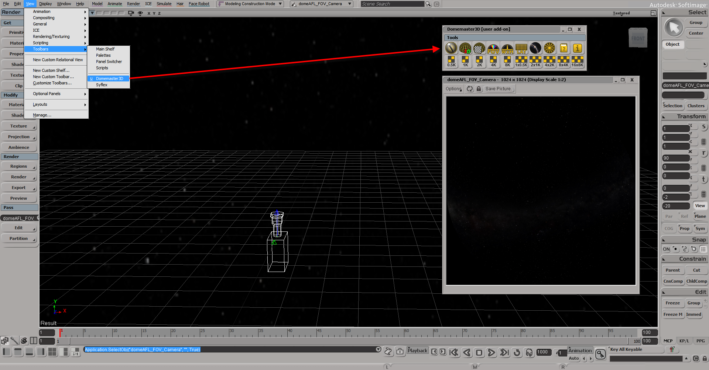
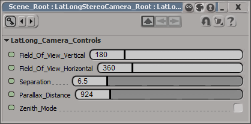

# Domemaster3D Lens Shader for Softimage #
**Version 1.6 Alpha 5 - October 27, 2014**  
Ported to Softimage by Andrew Hazelden

Email: [andrewhazelden@gmail.com](mailto:andrewhazelden@gmail.com)  
Web: [www.andrewhazelden.com](http://www.andrewhazelden.com)

`DomeAFL_FOV_Stereo` and `LatLong_Stereo` shaders created by Robert Ziche  
[http://fulldome.ning.com/forum/topics/stereoscopic-domemaster-images](http://fulldome.ning.com/forum/topics/stereoscopic-domemaster-images)
[https://github.com/zicher3d-org/domemaster-stereo-shader/](https://github.com/zicher3d-org/domemaster-stereo-shader/)

`DomeAFL_FOV_Stereo` is Based upon Daniel Ott's 2D "DomeAFL" Angular fisheye lens shaders
[http://www.thedott.net/shaders/domeAFL/](http://www.thedott.net/shaders/domeAFL/)

Domemaster3D Softimage Wiki  
[https://github.com/zicher3d-org/domemaster-stereo-shader/wiki/Softimage-Domemaster3D-Install](https://github.com/zicher3d-org/domemaster-stereo-shader/wiki/Softimage-Domemaster3D-Install)

## About This Shader ##

The Domemaster Stereo lens shader is a custom mental ray shader that creates a stereoscopic 3D fisheye image. The lens shader provides advanced controls to optimize the viewing experience for stereoscopic dome renderings.

The Domemaster3D shader for Softimage includes a new toolbar which automates the most common tasks.

The Softimage Domemaster3D toolbar has buttons for the following features: 

- The **AutoMagic** tool creates a Domemaster3D fulldome stereo camera rig and a hemispherical yellow wireframe test scene 
- The **Stereo Rig** tool creates a standard Domemaster3D stereo camera rig
- The **Dome Texture** tool creates a screen space file texture 
- The **DomeAFL FOV** tool creates a standard 2D domeAFL FOV node + camera
- The **DomeAFL WxH** tool creates a standard 2D domeAFL WxH node + camera 
- The **LatLong tool** creates a 2D latlong_lens node + camera 
- The **LatLong3D tool** creates a 3D LatLong_Stereo node + camera 
- The **Starglobe tool** creates a starry background for your fulldome scenes.
- The **DomeGrid tool** creates a hemispherical yellow wireframe reference grid. 
- The **DomeViewer tool** creates an immersive fulldome viewer. 
- The **S3D View tool** creates a Softimage Fx Tree node graph that performs red/cyan anaglyph stereo merging of your left and right render passes.
- The **Wiki Help** tool loads the Domemaster Stereo Shader Wiki page in your web browser. 
- The **Version Info** tool shows the current version number for the Domemaster Stereo Shader. 
- The **0.5k** button sets the render resolution to 512x512 pixels.
- The **1k** button sets the render resolution to 1024x1024 pixels.
- The **2k** button sets the render resolution to 2048x2048 pixels.
- The **4k** button sets the render resolution to 4096x4096 pixels.
- The **8k** button sets the render resolution to 8192x8192 pixels. 
- The **8k** button sets the render resolution to 8192x8192 pixels. 
- The **1x0.5K** button sets the render resolution to a latlong optimized 1024x512 pixels. 
- The **2.x1K** button sets the render resolution to a latlong optimized 2048x1024 pixels. 
- The **4x2K** button sets the render resolution to a latlong optimized 4096x2048 pixels. 
- The **8x4K** button sets the render resolution to a latlong optimized 8192x4096 pixels. 
- The **16x8K** button sets the render resolution to a latlong optimized 16384x8192 pixels. 

## Starglobe Screenshot ##

The starglobe tool for Softimage makes it easy to add a starry night backdrop to your fulldome renderings. You can access the tool by opening the Domemaster3D toolbar.

## DomeViewer Screenshot ##

The DomeViewer tool allows you to preview a fulldome angular fisheye image in Softimage.

## LatLong_Stereo Screenshot ##

The Domemaster3D v1.6 release has added a new `LatLong_Stereo` node that makes it easy to render spherical stereoscopic images. 

You can access the controls by expanding the `LatLongStereoCamera_Root` object in the Explorer window, and double clicking on the `LatLong_Camera_Controls` object.

## Installing the Shader ##

Open Softimage.

From the File Menu Select > Add-On > Install...

In the Install Add-On window next to the Filename "Select a File..." section click on the button labeled "..."

In the file dialogue select the file `domemaster3D.xsiaddon`. This is the add-on package file that contains the Domemaster3D shader .dll and .spdl files. Click the "OK" Button.

The files that are contained in the `domemaster3D.xsiaddon` package will be listed in the Install Add-On window. Click the "Install" button to load the Domemaster3D files. By default the files will be copied into the Softimage Addons folder:

`C:\Users\<your user id>\Autodesk\Softimage_<Version Number>\Addons\domemaster3D`

Quit Softimage.

When you restart Softimage you can begin using the new lens shaders. The Domemaster3D lens shaders will be listed in the Lens tab of the Render Tree.

You should now have the following new lens shaders:  
    `domeAFL_FOV`  
    `domeAFL_FOV_Stereo`  
    `domeAFL_WxH`  
    `latlong_lens`  
    `LatLong_Stereo`  
    `rob_lookup_background`  

## How to add a Lens Shader in Softimage ##

Step 1. Select Your Camera

Open the explorer window to view all of the cameras in the current scene(hotkey Ctrl-8). 

Next, select a camera in the explorer window.

Press Alt-Enter to open the `Scene_Root:Camera:Camera` editor window

Step 2. Choose your lens shader

In the Camera Editor window click on the "Lens Shaders" tab. This view lists lens shaders currently applied to your camera.

Let's attach a new lens shader to the current camera. In the "Lens Shaders" tab click the Add button.

Pick one of the lens shaders from the pop-up menu such as `domeAFL_FOV_Stereo`.

## Domemaster3D Lens Shader Controls ##

**Field of View**: The field of view for the rendered fisheye image.

**Camera**: Choices are Center/Left/Right. Selects the camera to use for rendering. Center skips 90% of the calculations and gives you a highly optimized standard angular fisheye shader.

**Dome Radius** (focus plane): This is actually the distance at which the camera's line of sight converges. This is also known as the zero parallax distance so the control isn't really the dome size.

**Dome Forward Tilt**: Dome tilt in degrees. Note that this value is not used unless you enable Dome Tilt Compensation.

**Camera Separation**: The initial separation of the left and right cameras.

**Separation Multiplier**: A value between 0-1 that multiples the Camera Separation. This attribute is meant to be used with a grayscale texture mapped to the screen space using the right button. It's used to control the amount of 3D effect, and eliminate it where desired.

**Turn Multiplier**: A value 0-1 that controls the amount of the head turn. To be used with a grayscale texture. Typical use, keep the head straight while looking at the top of the dome.

**Head Tilt**: A value 0-1 (with 0.5 being the "neutral" value) that tilts the cameras (or head) left/right. 0 means 90 degrees to the left, 1 means 90 degrees to the right (if I remember correctly).

**Dome Tilt Compensation**: Enabling this option, shifts all the calculations by the # of degrees specified in Dome Forward Tilt. (Basically, it keeps the fulldome cameras / viewer's head vertical while the dome rotates forward.)

Maps used for the various multipliers and tilt settings will have to be custom made for the proper dome tilt.

**Vertical Mode**: Enables the vertical dome mode which automatically adjusts the head turn setting and adds a turn compensation for the upper and lower part of the dome. It's a simplified and optimized version of the Dome Tilt Compensation with a 90 degree tilt angle. It is faster and easier to use.

## Node connections ##

Set the `mib_texture_vector` "selspace" aka. select space value to 4 (screen space) to enable the camera UV space projection. This means the texture will be loaded using a projection to the UV space coordinates of the camera.

    mib_texture_vector.out -> mib_texture_remap.input
    
    mib_texture_remap.out -> mib_texture_filter_lookup.coord
    separation_map_png.tex -> mib_texture_filter_lookup.tex
    
    mib_texture_filter_lookup.out -> Color_to_Scalar.input -> rob_lookup_background.tex
    
    rob_lookup_background.out -> Camera Lens Shader.item

## How to make the custom map connections ##

Start by placing your texture maps for controlling the camera separation and turn maps in the "Pictures" folder for your current Softimage project. 

Select your current camera and open the Render tree. (Shift-7)

In the Render Tree toolbar click the update icon (circular arrows) to load the current nodes in the Render Tree view. Display the preset manager view.

Step 1. Connect the Domemaster 3D Shader

Scroll down in the Render tree sidebar to the SPDL Shaders -> lens section. Add a `domeAFL_FOV_stereo` shader to the work area.

Connect `domeAFL_FOV_Stereo.out` to the Camera lens Shaders.item

Step 2. Let's create the supporting nodes for the custom separation map

The `rob_lookup_background` shader lets you preview your camera coordinate space Separation and Head Turn Map textures before you map them to the domemaster shader `DomeAFL_FOV_Stereo`.

Scroll up to the Processing -> Conversion section in the render tree.
Add a "Color to Scalar" node to the work area. This node will convert the texture from an RGB image into a greyscale "tex" image.
Connect `Color_To_Scalar.out` to `rob_lookup_background.tex` 

Scroll down in the Render tree sidebar to the mental ray -> texture section. Add a `mib_texture_filter_lookup` node to the work area. This node merges the image data with our custom camera space UV coordinates.
Connect `mib_texture_filter_lookup.out` to `Color_to_Scalar.input`.

Double click on the `mib_texture_filter_lookup` node in the render tree to open the editor. In the editor window next to the tex attribute click the New button. In the pop-up menu select "New From File...". 

A "New Image Clip" dialogue will appear that lets you select a file texture from your hard drive. Select the file `separation_map.png` from the `domemaster3D_sample_project\Pictures` folder. Click the "OK" Button.

The `mib_texture_filter_lookup` node should now display a crescent shaped preview icon in the "tex" section.

Let's connect the custom nodes to create the camera space UV coordinates. Start by closing any floating editor windows. 

We need to add two more nodes to the Render Tree. In the sidebar click on the mental ray -> textures section add a `mib_texture_vector` and a  `mib_texture_remap` node.

Double click on the `mib_texture_vector` node. In the editor window change the `mib_texture_vector` node's selspace value to 4. This means the node will select the UV space for the texture from the current camera's UV coordinates. Close the floating editor window.

Connect the `mib_texture_vector.out` to the `mib_texture_remap`.input.

Connect the `mib_texture_remap.out` to the `mib_texture_filter_lookup.coord`.

Deselect all of the nodes in the render tree. From the Tools menu in the Render Tree window select Rearrange (Ctrl-R) to cleanup the work area.

To see the results of the `rob_lookup_background` shader you need to click the 'preview' or 'render' buttons.

