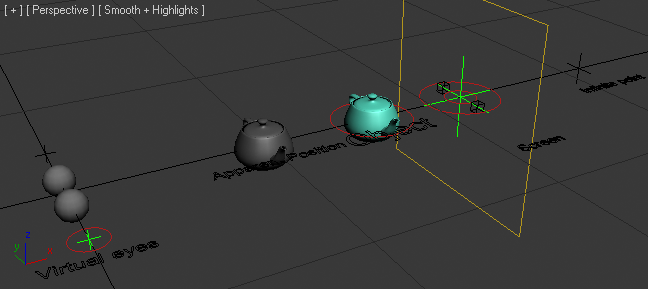
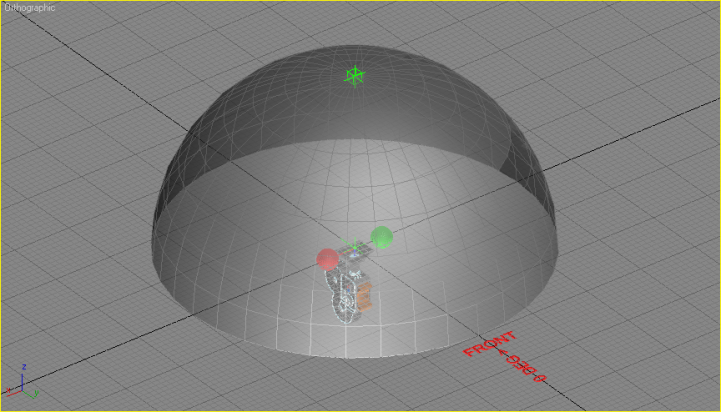
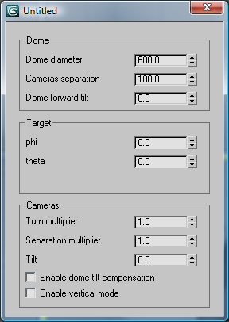

# Fulldome Stereo Simulator Math #

----------

2015-03-21 11.46 am

During the development stage of the DomemasterStereo / domeAFL_FOV_Stereo shader, Roberto Ziche used several 3DS Max test scenes with expressions to simulate the camera separation and convergence controls.

The original simulator files were posted and discussed on the Domemaster Stereo Shader NING group threads:

- [April 11, 2011](http://www.fulldome.org/forum/topics/stereoscopic-domemaster-images?commentId=2223423%3AComment%3A9403)
- [September 16, 2011](http://www.fulldome.org/xn/detail/2223423:Comment:20709)
- [December 7, 2011](http://www.fulldome.org/xn/detail/2223423:Comment:25802)
- [December 11, 2011](http://www.fulldome.org/xn/detail/2223423:Comment:25809)
- [March 23, 2012](http://www.fulldome.org/xn/detail/2223423:Comment:27641)

## Simulator Screenshots ##

## 3DS Max Scene Files ##

The following 3DS Max based simulator scenes are stored in the project's Github folder `/research/3DS Max Simulator Scenes/`:

- cameras_rig_test09_dual05.zip (contains a max script and a scene file)
- 3dsetupsimulator.max
- stereo_images_check.max
- stereo_images_check_single.max

## Simulator Notes ##

Since the domeAFL_FOV_Stereo shader's initial development was done without access to a planetarium to review how the 3D effect would look like once projected on the dome, and there was no chance to do testing on any real planetarium, Roberto Ziche, created a simulator that allows an artist to predict the apparent position of any object in the dome space with specific rendering parameters.

This simulator illustrates two things that can actually be used to our advantage to create manageable finite size worlds. First, the non-linear movement of the apparent object. And this can be used to establish areas closer to the camera that have enhanced depth effect. Second, the presence of a point where objects will appear at infinite. Knowing that point, we can have objects set at reasonable distances from the scene center for our background.

### Stereo Review Test Scene ###

Some of the simulator scenes require sample angular fisheye dome images to review the effect. You can use any domeAFL_FOV_Stereo / DomemasterStereo left and right images as the input. All the paths used will need to be adjusted and won't work until you do that. You can check the Asset Tracking dialog to see the paths that are currently in use.

The typical workflow to use the dome previewing scene is as follows:

- Orient/animate the cameras
- Tilt the domes properly (one cam/dome only, the other will match the first
- Run a Batch rendering to create the stereo pair
- The finally use the video post to composite the relaxed-eye image in the frame buffer.

### Stereo Math and Convergence Test Scene ###

This scene is a concoction that was used during development to see the effect of the stereo 3D parameters. The only objects you can select and move are the "parameters". The blue teapot is your object, the gray one is the apparent position of the object.

You can change the eye separation of one eye and the other will move automatically. The screen distance, the convergence point (which in my tool is 1/2 the dome diameter setting), and the teapot distance.

Keep an eye on is the apparent infinite point. It can be used to your advantage :)

The simulator scene and max script uses the same math behind the lens shader. The formulas used here are the exact same used in the compiled mental ray C code shader. The scene setup is done to simulate the actual mental ray camera space.

Load the scene, run the script. It will reset the scene, and then you can adjust all the parameters from the dialog that pops up. The camera shows you the mental ray camera orientation, and the Red and Lime green represent the Right and Left virtual cameras created by the lens shader.

With this you can see the effect of the settings on the virtual cameras. Just use Phi and Theta to move the target point on the dome surface. I developed the formulas here, then I copied them to the C code and it worked at the first attempt. :)

The camera separation should be chosen based on the desired 3D effect and the size of the dome.

These scene files are strictly a simulator that can give you an idea of the stereo effect. It tells you if the camera separation with a specific dome size would create objects that appear beyond infinite. It can also estimate the distances where the 3D effect is more or less linear, and where it starts becoming exponential.

